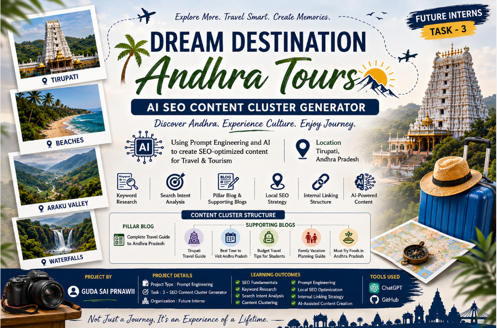

# 🌍 AI SEO Content Cluster Generator for a Travel Agency

<p align="center">
  
</p>

## Project By
**GUDA SAI PRANAWII**  
**Future Interns – Prompt Engineering Task 3**

---

# Introduction

This project demonstrates how Prompt Engineering can be used to generate SEO-friendly content for a local travel agency business. A travel agency based in Tirupati, Andhra Pradesh was selected to create a complete SEO content cluster, including a pillar blog, supporting blogs, keyword research, search intent analysis, local SEO strategy, and internal linking recommendations.

The selected business is **Dream Destination Andhra Tours**, as shown in the project banner.

---

# Business Selected

**Business Name:** Dream Destination Andhra Tours  
**Location:** Tirupati, Andhra Pradesh, India  
**Industry:** Travel & Tourism

---

# Project Objectives

- Generate SEO-optimized blogs using AI prompts
- Create a complete content cluster structure
- Perform keyword research and analysis
- Understand different search intents
- Implement Local SEO strategies
- Create internal linking opportunities
- Demonstrate effective Prompt Engineering techniques

---

# Tools Used

- ChatGPT
- Prompt Engineering
- GitHub
- Markdown

---

# Keyword Research

## Primary Keyword
**Andhra Pradesh Travel Guide**

## Secondary Keywords

- Tirupati Travel Guide
- Best Places to Visit in Andhra Pradesh
- Andhra Pradesh Tourism
- Andhra Pradesh Tour Packages
- Travel Agency in Tirupati
- Family Vacation in Andhra Pradesh
- Budget Travel Tips India
- Best Time to Visit Andhra Pradesh

---

# Search Intent Analysis

| Keyword | Search Intent |
|----------|---------------|
| Andhra Pradesh Travel Guide | Informational |
| Tirupati Travel Guide | Informational |
| Best Places to Visit in Andhra Pradesh | Informational |
| Budget Travel Tips India | Informational |
| Andhra Pradesh Tour Packages | Commercial |
| Family Vacation in Andhra Pradesh | Commercial |
| Travel Agency in Tirupati | Transactional |
| Andhra Pradesh Tourism | Informational |

---

# Content Cluster Structure

## Pillar Blog

### Complete Travel Guide to Andhra Pradesh

This serves as the main pillar content and links to all supporting blogs.

## Supporting Blogs

### 1. Tirupati Travel Guide
### 2. Best Time to Visit Andhra Pradesh
### 3. Budget Travel Tips for Students
### 4. Family Vacation Planning Guide
### 5. Must-Try Foods in Andhra Pradesh

---

# Local SEO Strategy

### Local SEO Keywords

- Travel Agency in Tirupati
- Tirupati Travel Guide
- Andhra Pradesh Tourism
- Andhra Pradesh Tour Packages
- Best Places to Visit in Andhra Pradesh

### Benefits

- Improved local search rankings
- Increased website visibility
- Better user engagement
- Enhanced location relevance

---

# Internal Linking Strategy

Hub-and-spoke SEO structure:

**Pillar Blog**
- Complete Travel Guide to Andhra Pradesh

**Supporting Blogs**
- Tirupati Travel Guide
- Best Time to Visit Andhra Pradesh
- Budget Travel Tips for Students
- Family Vacation Planning Guide
- Must-Try Foods in Andhra Pradesh

All supporting blogs link back to the pillar blog to strengthen SEO authority.

---

# Repository Structure

```text
FUTURE_PE_03_SEO_CONTENT_CLUSTER/
│
├── README.md
├── banner.png
├── prompts/
├── keyword_research/
├── pillar_blog/
├── supporting_blogs/
├── screenshots/
```

---

## Learning Outcomes

✅ SEO Fundamentals  
✅ Keyword Research  
✅ Search Intent Analysis  
✅ Content Clustering  
✅ Prompt Engineering  
✅ Local SEO Optimization  
✅ Internal Linking Strategy  
✅ AI-Assisted Content Creation


---

# Conclusion

This project demonstrates the effective use of Prompt Engineering to create an SEO content cluster for a travel agency. By combining keyword research, search intent analysis, content clustering, and Local SEO strategies, AI-assisted content creation was successfully implemented. The project enhanced practical knowledge of SEO and Prompt Engineering concepts.
